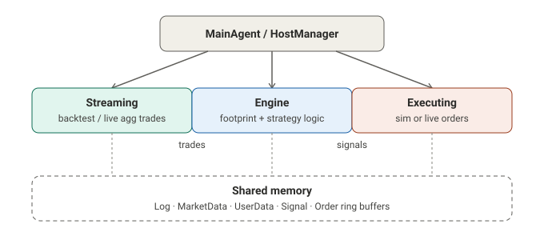
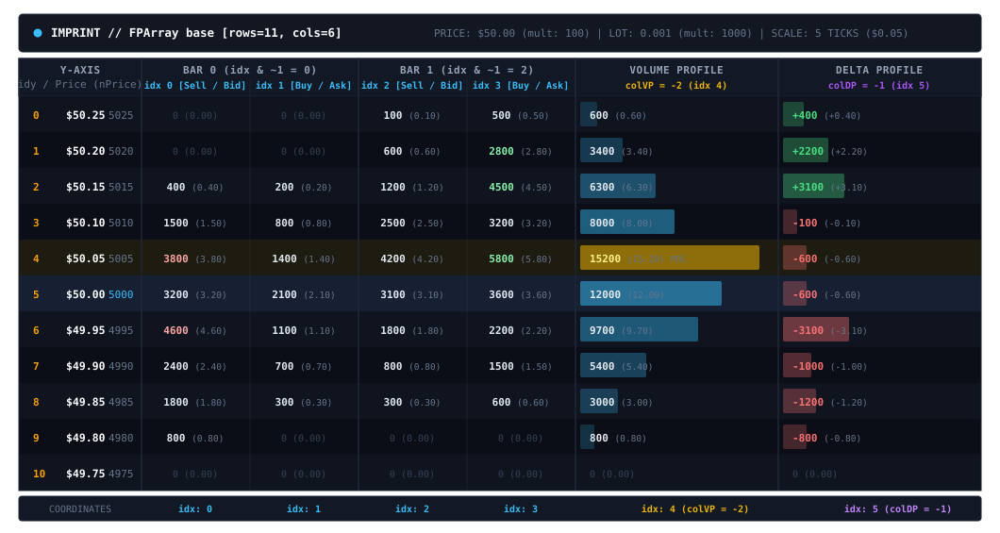
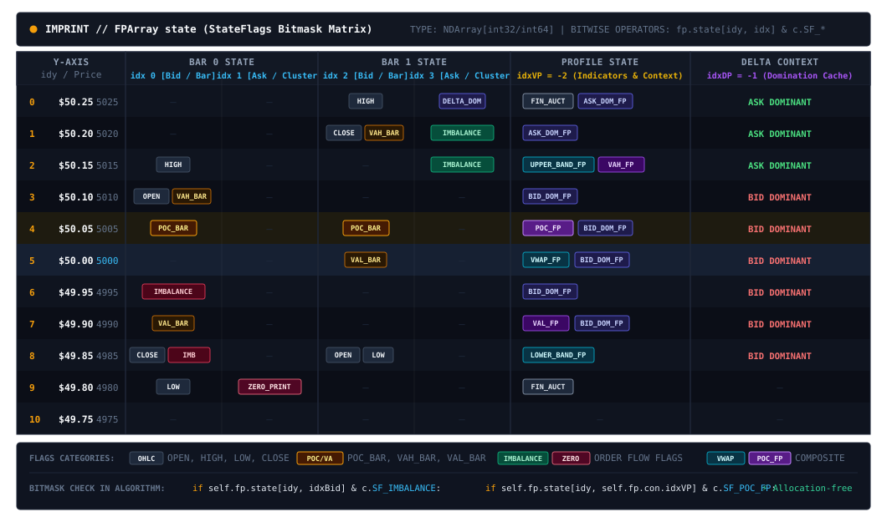
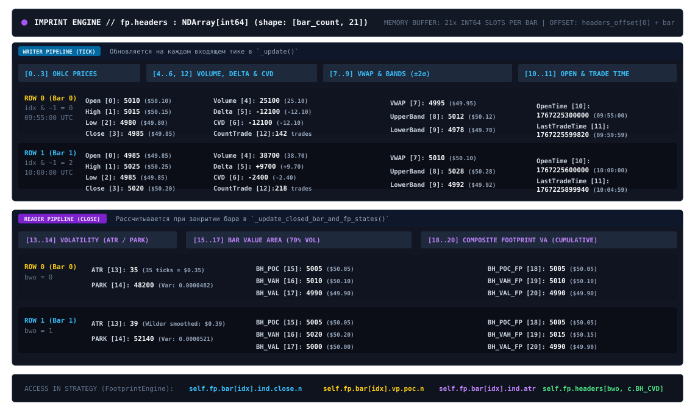
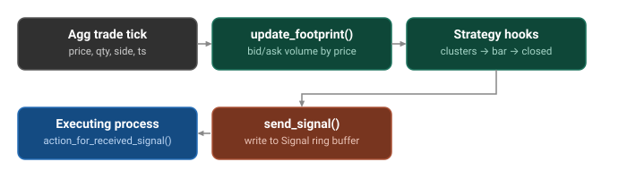

<div align="center">

# Imprint

**Multiprocess order-flow engine for backtesting and live crypto futures execution**

[](https://www.python.org/downloads/)
[](https://github.com/shs-me/Imprint/actions/workflows/ci.yml)
[](#status)
[](https://opensource.org/licenses/MPL-2.0)

</div>

<details open>
<summary><b>Table of Contents</b></summary>

- [Overview](#overview)
- [Architecture](#architecture)
- [Installation](#installation)
- [Quick start](#quick-start)
- [Configuration reference](#configuration-reference)
- [Footprint](#footprint)
- [Visualization](#visualization)
- [Project layout](#project-layout)
- [Requirements](#requirements)
- [Development](#development)
- [Status](#status)
- [Disclaimer](#disclaimer)
- [License](#license)
- [Author](#author)

</details>

---

<details open>
<summary><h2>Overview</h2></summary>

**Imprint** is a multiprocess trading engine designed for single-pair order-flow and footprint strategies. It provides a unified framework for crypto futures backtesting and live execution, focusing on market microstructure and low-latency data processing.

- **Unified Strategy & Execution Logic**: Both your footprint algorithm and execution model are written once—running identically across backtest simulation and live exchange routing.
- **Multiprocess Zero-Copy IPC**: Market data ingestion, footprint analytics, and execution routing run in separate OS processes communicating via shared-memory ring buffers, bypassing the GIL.
- **Footprint & Cluster Core**: Reconstructs real-time tick-by-tick cluster matrices, volume/delta profiles, and over 20 built-in indicators and auction state flags directly from trade streams.
- **Pseudo-Matching Engine**: A lightweight execution simulator for backtesting that evaluates Limit, Market, and OCO fills with synthetic latency, slippage, and margin tracking.
- **Low-Latency & Fixed-Point Math**: Avoids float arithmetic throughout the engine by maintaining all prices, sizes, and balances as scaled integers, compiling critical hot paths to native code with Numba.

</details>

<details open>
<summary><h2>Architecture</h2></summary>



- **`core.pipeline.streaming`** — replays historical trades (`streaming/backtest`)
  or consumes a live exchange WebSocket (`streaming/live`), pushing raw trades
  into the `DataStream` ring buffer.
- **`core.footprint`** — `FootprintEngine` (aliased `Reader`) rebuilds footprint
  bars per trade and calls three overridable hooks on your algorithm:
  `on_clusters_update`, `on_bar_update`,
  `on_bar_close`.
- **`core.pipeline.executing`** — reads from the `Signal` ring buffer and turns
  signals into orders via your `BaseExecution` subclass, routed to either the
  simulated matching engine (`core.exchange.sim`) or a live connector.
- **`core.ipc`** — `HostManager` (main process) / `NodeManager` (workers) bind
  shared-memory segments to typed config dataclasses; `supervisor()` wraps every
  worker entrypoint with `Dispatcher` setup/teardown.
- **`visualization`** — post-run metrics (`analyze/`) and a matplotlib dashboard
  (`plot/`) rendered to a standalone HTML report (`render/html.py`).

</details>

<details open>
<summary><h2>Installation</h2></summary>

Pinned to **Python 3.13.12**, built with Hatch/`hatchling`.

```bash
git clone https://github.com/shs-me/Imprint.git
cd Imprint

python -m venv .venv
source .venv/bin/activate      # Windows: .venv\Scripts\activate

pip install -e ".[all]"        # or "[plot]" / "[dev]" individually
```

| Extra  | Installs             | Use case                       |
|--------|-----------------------|---------------------------------|
| `plot` | `matplotlib`          | HTML dashboard rendering        |
| `dev`  | `pytest`, `pytest-cov`, `ruff` | Tests and linting      |
| `all`  | `plot` + `dev`        | Everything                      |

</details>

<details open>
<summary><h2>Quick start</h2></summary>

See [`example/`](./example) for a complete runnable implementation.

> The public API lives under `imprint.api.setup`
```python
from imprint.api.setup import (
    Account, Backtest, Connector, Footprint, Imprint,
    Live, pct, RiskManagement, Strategy, Timeframe,
)

from my_strategy.algorithm import MyIntraDayAlgorithm
from my_strategy.execution import MyHedgeExecution
from my_strategy.binance_adapters import (
    MyAggTradesDecoder, MyOrderEncoder, MyUserStreamDecoder,
)

imp = Imprint(
    run_mode=Backtest,
    backtest=Backtest(
        account=Account(leverage=50, balance=5_000),
        tick_size="0.01",
        lot_size="0.001",
        backtest_start_date="2026-01-01",
        backtest_end_date="2026-01-07",
    ),
    live=Live(  # required even in backtest mode — pass empty/placeholder values
        connector=Connector(),
        agg_trades_decoder=MyAggTradesDecoder,
        order_encoder=MyOrderEncoder,
        user_stream_decoder=MyUserStreamDecoder,
    ),
    symbol="DASHUSDT",
    strategy=Strategy(
        algorithm=MyIntraDayAlgorithm,
        footprint=Footprint(timeframe=Timeframe.M5, step_tick=5),
        risk_management=RiskManagement(entry_qty=pct(0.5), max_loss_balance=pct(10.0)),
    ),
    execution=MyHedgeExecution,
    with_execution=True,
)

imp.run_core()   # runs the streaming/engine/executing processes
imp.run_vis()    # renders the HTML dashboard from the run's dump files
```

`run_core()` and `run_vis()` are two separate calls; the dashboard is generated from
the equity/orders/footprint-header dumps left on disk after `run_core()` exits.

### 1. Defining a strategy

Subclass `FootprintEngine` and implement the three pattern-detection hooks.
`self.fp` exposes the live footprint (`fp.bar[idx].ind.*` for OHLC/ATR/CVD/POC,
`fp.vp` / `fp.dp` for volume/delta profiles); call `self.send_signal(...)` to
emit a signal.

```python
from numpy import int64
from imprint.api.setup import FootprintEngine


class MyIntraDayAlgorithm(FootprintEngine):
    def on_clusters_update(
        self, idYmin: int64, idYmax: int64, idXmin: int64, idXmax: int64
    ) -> None: ...

    def on_bar_update(
        self, idYmin: int64, idYmax: int64, idxBid: int, idxAsk: int
    ) -> None: ...

    def on_bar_close(self) -> None:
        idx = self.last_idx[0]
        close = self.fp.bar[idx].ind.close.n
        atr = self.fp.bar[idx].ind.atr
        # ... your logic ...
        self.send_signal(is_market=True, is_long=True, is_buy=True, idy=close)
```

### 2. Defining execution logic

Subclass `BaseExecution`; the same subclass drives both the simulator and a
live account.

```python
from imprint.api.setup import BaseExecution


class MyHedgeExecution(BaseExecution):
    def on_signal(
        self, time_get_signal: int, order_param: int, nPrice: int, nQty: int
    ) -> None:
        self.send_order(
            timestamp=time_get_signal + self.con.latency,
            order_param=order_param,
            client_order_id=self.con.newClientOrderId,
            nPrice=nPrice,
            nQty=nQty,
        )
```

Live exchange support requires an `AggTradesDecoder`, `OrderEncoder`, and
`UserStreamDecoder` per venue — reference implementations for Binance and
Bybit futures are in [`example/`](./example).

</details>

<details open>
<summary><h2>Configuration reference</h2></summary>

All configuration is centralized under `imprint.api.setup`:

- **`Imprint`** — Top-level runner object combining mode, symbol, strategy, and execution.
- **`Backtest`** & **`Live`** — Environment settings (historical date ranges or exchange connectors/decoders).
- **`Account`** & **`RiskManagement`** — Financial parameters, leverage, balances, commissions, SL/TP rules, and risk limits.
- **`Strategy`** & **`Footprint`** — Algorithm hooks, timeframe, and row resolution settings.
- **`Connector`** — REST/WS base URIs for live venues.

*(Internally, these assemble into low-level shared-memory dataclasses in `imprint.core.configs`).*

</details>

<details open>
<summary><h2>Footprint</h2></summary>

Market microstructure is maintained across three synchronized memory matrices—**Base Grid**, **State Matrix**, and **Headers Registry**—providing instant access to cluster volume, auction mechanics, and bar-level indicators on every trade.

### 1. Base Grid (Volume & Delta Distribution)

A 2D cluster matrix mapping raw volume into discrete price-time coordinates:
- **Price Axis (Rows)**: Continuous price levels discretized by the configured tick step.
- **Time Axis (Columns)**: Each bar allocates two dedicated columns—one for aggressive market sellers (Bid Volume) and one for aggressive market buyers (Ask Volume).
- **Composite Session Profiles**: The terminal columns continuously accumulate the visible session into global Volume and Delta profiles.



### 2. State Matrix (Microstructural Bitmasks)

A 2D bitmask matrix mirroring the dimensions of the Base Grid. Instead of volume quantities, each cell stores auction events and order-flow conditions packed into integer bitmasks, enabling O(1) condition queries directly from strategy logic without grid scans.



### 3. Headers Registry (Bar-Level Metadata)

A continuous 2D registry indexing summary statistics and indicator values per bar. Each row stores the complete statistical profile of an individual bar, allowing strategy logic to inspect historical bars in O(1) time without traversing cluster cells.



### 4. Built-in Indicators & Market States

The engine automatically calculates and updates over 20 pre-computed metrics and auction states on every tick:

- **Price & Execution**: Open, High, Low, Close, Range (absolute & %), Change (absolute & %), Bar Open/Last Trade Time, Trade Count.
- **Order Flow & Volume**: Total Bar Volume, Bar Delta, Delta Ratio, Cumulative Volume Delta (CVD), Average Volume/Trade Count (20-period), Average Trade Size.
- **Volatility & Bands**: Rolling VWAP, VWAP Standard Deviation Bands (±2σ), Average True Range (ATR & %), Parkinson High/Low Volatility Variance.
- **Auction Benchmarks**: Point of Control (POC), Value Area High (VAH), Value Area Low (VAL) covering 70% volume distribution — computed for both individual bars and session-wide profiles.
- **Cluster Microstructure**: Diagonal Volume Imbalance (≥ 3x), Zero-Prints (trapped liquidity), Delta Domination (Bid/Ask dominance), Finished / Unfinished Auction extremes, Absorption, Exhaustion, Large Trade prints.

### 5. Tick-to-Signal Execution Cycle

Every aggregated trade flows through a deterministic, low-latency processing loop inside the Engine process:

1. **Ingestion**: Raw trades are pulled from the shared-memory data ring buffer.
2. **Matrix Update**: Trade volume accumulates into the Base Grid, expanding an active **Bounding Box (BBOX)** that isolates only modified price-time coordinates.
3. **Selective Analysis**: Indicator calculations, state flag bitmasks, and strategy callbacks (`on_clusters_update`, `on_bar_update`, `on_bar_close`) evaluate exclusively within the dirty BBOX area.
4. **Latency Budget Guard**: Elapsed analysis time is measured against the configured microsecond limit. Delayed decisions are automatically dropped to prevent stale executions before signals enter the execution ring buffer.



</details>

<details open>
<summary><h2>Visualization</h2></summary>

`imp.run_vis()` processes dumped execution artifacts (equity curve, order logs, footprint headers) into a standalone, interactive Plotly HTML report requiring no backend server.

> 📊 **Live Demo**: Explore a sample interactive backtest report on [GitHub Pages](https://shs-me.github.io/Imprint/).

### Key Features
- **Synchronized Overview (2:1 Layout)**: Vertically coupled Dynamic Equity/Drawdown and Candlestick execution chart with shared X-axis panning and trade markers.
- **Smart Viewport & Timeframe Resampling**: Focuses on the most recent 144 bars by default with free historical navigation, one-click `ALL` history expansion, and on-the-fly timeframe switching.
- **Institutional KPI Tear-Sheet**: Multi-column analytics panel covering portfolio returns, risk ratios (Sharpe, Sortino, Calmar), Van Tharp SQN, Kelly Criterion, streaks, and Long vs. Short directional breakdowns.
- **Order-Flow Trade Distribution**: High-density profile mapping realized PnL against Maximum Favorable Excursion (MFE) and Maximum Adverse Excursion (MAE) relative to entry price.
- **Full-Screen Workspace**: One-click native full-screen mode optimizing chart real estate for deep microstructure analysis.

</details>

<details open>
<summary><h2>Project layout</h2></summary>

```
Imprint/
├── src/imprint/
│   ├── api/
│   │   └── setup.py         # Imprint, Backtest, Live, Strategy — the public API
│   ├── core/
│   │   ├── configs.py        # low-level dataclasses + shared-memory segment layout
│   │   ├── exchange/
│   │   │   ├── account/       # position & balance tracking
│   │   │   └── sim/            # matching engine, simulated order/tick streams
│   │   ├── footprint/
│   │   │   ├── engine/          # Reader (aliased FootprintEngine), Router, Writer
│   │   │   └── models/           # Footprint, Bar, VolumeProfile, DeltaProfile
│   │   ├── ipc/                # HostManager, NodeManager, Dispatcher, supervisor
│   │   └── pipeline/
│   │       ├── streaming/        # backtest replay / live WS ingestion
│   │       ├── engine/            # per-tick footprint + strategy loop
│   │       └── executing/          # signal → order routing (sim or live)
│   └── visualization/          # metrics, matplotlib plots, HTML report
├── example/                   # runnable strategy + Binance/Bybit adapters
└── tests/                # pytest suite
```

</details>

<details open>
<summary><h2>Requirements</h2></summary>

- Python **3.13.12** exactly (`requires-python == "3.13.12"`)
- `numpy==2.4.6`, `numba==0.66.0`, `msgspec==0.21.1`, `websockets==16.1.1`, `loguru==0.7.3`
- POSIX-compliant OS recommended for `multiprocessing.shared_memory`

</details>

<details open>
<summary><h2>Development</h2></summary>

```bash
pip install -e ".[dev]"

ruff check .
pytest
```

CI (`.github/workflows/ci.yml`) runs both on every push/PR to `master`.

</details>

## Status
Alpha, single-author, pre-1.0. 
The top-level API is `Imprint`. Shared-memory layouts and config dataclasses may still
change without notice; pin to a commit if you depend on this in production.

## Disclaimer
Research/educational software. Not financial advice. Backtested performance
does not guarantee future results. Test thoroughly in simulation before
deploying with real capital.

## License
This project is licensed under the **Mozilla Public License 2.0**. See the [LICENSE](LICENSE) file for the full text.

## Author
**Sherali Safaralizoda** — [imprint+shs06main@gmail.com](mailto:imprint+shs06main@gmail.com)
